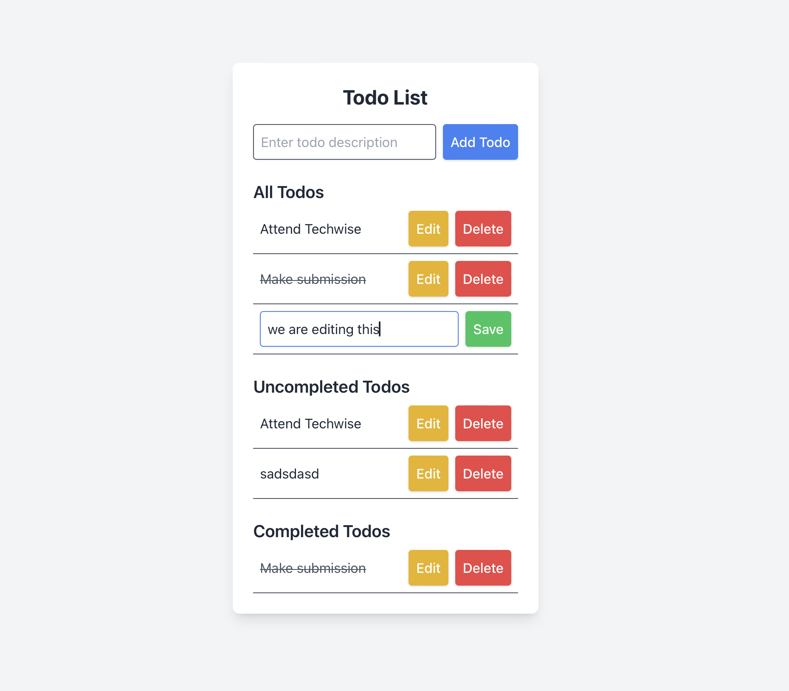

---

# Todo List Application

## Description
This Todo List web application is built using React, Vite, and TypeScript. The application allows users to manage their daily tasks with a simple and intuitive interface. The project demonstrates competency in web systems design, including UI development, testing, and containerization.

## Features
- **Create a new Todo**: Users can add new todos by providing a description.
- **Change the description of a Todo**: Users can edit the description of existing todos.
- **Complete a Todo**: Users can mark todos as completed.
- **Delete a Todo**: Users can delete todos they no longer need.
- **View all Todos**: Users can view a list of all todos.
- **View uncompleted Todos**: Users can filter and view only uncompleted todos.
- **View completed Todos**: Users can filter and view only completed todos.

## Technologies Used
- **Frontend**: React, Vite, TypeScript
- **Styling**: Tailwind CSS
- **Testing**: Jest, @testing-library/react
- **Containerization**: Docker

## Installation

### Prerequisites
- Node.js (>= 14.x)
- Docker (>= 20.x)

### Steps
1. Clone the repository:
   ```bash
   git clone https://github.com/yourusername/todo-list-app.git
   cd todo-list-app
   ```

2. Install dependencies:
   ```bash
   npm install
   ```

3. Start the development server:
   ```bash
   npm run dev
   ```

4. Open the application in your browser:
   ```bash
   http://localhost:3000
   ```

### Docker

1. Build the Docker image:
   ```bash
   docker build -t my-todo-app .
   ```

2. Run the Docker container:
   ```bash
   docker run -p 3000:3000 my-todo-app
   ```

3. Access the application:
   ```bash
   http://localhost:3000
   ```

## Testing

To run the tests, use the following command:
```bash
npm test
```

This will run the tests using Jest and display the results in the console.

## Project Structure

```
my-todo-app
├── public
│   ├── index.html
├── src
│   ├── components
│   │   ├── TodoForm.tsx
│   │   ├── TodoItem.tsx
│   │   ├── TodoList.tsx
│   ├── tests
│   │   ├── TodoForm.test.tsx
│   ├── App.tsx
│   ├── main.tsx
│   ├── index.css
│   ├── setupTests.ts
│   ├── vite-env.d.ts
├── jest.config.cjs
├── Dockerfile
├── package.json
├── tailwind.config.js
├── tsconfig.json
└── tsconfig.node.json
```

## Screenshots




## License

This project is licensed under the MIT License.

---